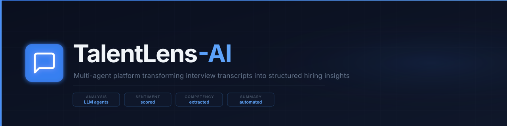
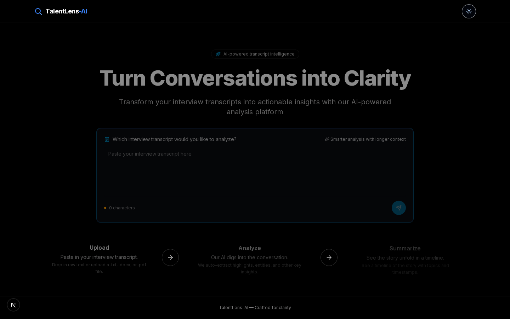
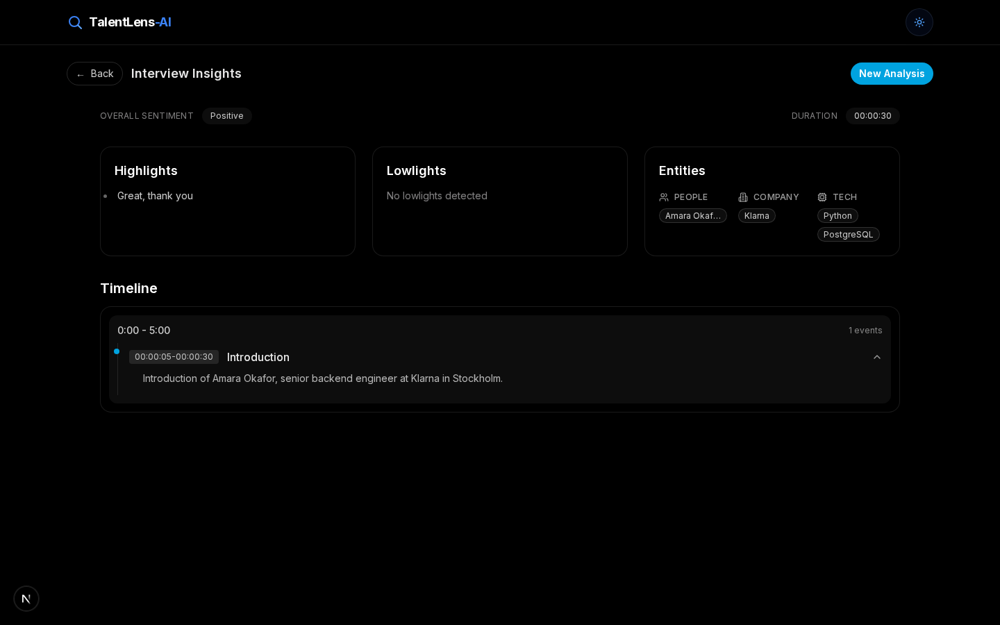

# TalentLens-AI

<p align="center">
  
  
  
  
  
</p>

<p align="center">
  <strong>Multi-agent platform that turns raw interview transcripts into structured hiring insights</strong><br/>
  Timeline extraction · entity recognition · sentiment analysis · competency profiling
</p>

<p align="center">
  
</p>

## Live Demo

**Live:** [https://talentlens-ai-demo.vercel.app](https://talentlens-ai-demo.vercel.app)

## Screenshots

<p align="center">
  
</p>
<p align="center">
  
</p>

## What It Does

TalentLens-AI takes a raw interview transcript and turns it into a structured summary: a
timestamped timeline of the conversation, extracted entities (people, companies, technologies,
locations), sentiment highlights/lowlights, and key topics. A recruiter or hiring manager pastes
a transcript in and gets back a navigable analysis instead of re-reading the whole conversation.

## Quick Start

```bash
git clone git@github.com:Hamilas/TalentLens-AI.git
cd TalentLens-AI

# Backend (FastAPI, in-memory storage, works with no API keys, falls back to a fake model)
docker compose up -d --build
# → API: http://localhost:8073  (docs at /docs)

# Frontend (Next.js, run separately)
cd frontend
pnpm install
BACKEND_URL=http://localhost:8073 pnpm dev
# → App: http://localhost:3000

# Demo (zero setup, opens in any browser)
open demo/index.html
```

To use a real LLM instead of the fake fallback, set `ANTHROPIC_API_KEY`, `OPENAI_API_KEY`, or
`GROQ_API_KEY` in `docker-compose.yml` before building.

## How It Works

1. The user pastes a transcript into the textarea on `/` and hits send
2. The Next.js frontend proxies the request through its own `/api/transcript/analyze` route
   (`frontend/src/app/api/transcript/analyze/route.ts`) to the FastAPI backend
3. The `transcript-analyzer` LangGraph agent (`backend/src/app/agents/transcript_analyzer.py`)
   receives the transcript and runs it through the configured LLM
4. If no API key is configured for the requested model, the backend automatically falls back to
   a fake model so the demo works end-to-end with zero setup
5. In development, identical transcripts are served from a local response cache
   (`backend/src/data/llm_responses/`) to avoid repeat LLM calls and speed up iteration
6. The agent's response is parsed into a structured `TranscriptSummary` (timeline, entities,
   sentiment, key topics)
7. The frontend stores the result in `sessionStorage` and navigates to `/analysis`, which renders
   the timeline, entity chips, and sentiment highlights

## Tech Stack

| Layer | Technology | Why |
|-------|-----------|-----|
| Backend | FastAPI, Python 3.11 | Async API layer, auto-generated OpenAPI docs |
| AI orchestration | LangGraph, LangChain | Multi-agent graph with tool-calling and interrupts |
| LLM providers | Anthropic Claude, OpenAI, Groq | Model-agnostic, pick per deployment, fake fallback for demos |
| Storage | SQLAlchemy 2.0 + Alembic | In-memory SQLite for demos, PostgreSQL for production |
| Frontend | Next.js 15 (App Router), React 19, TypeScript | Server-rendered UI with typed API proxy routes |
| UI | shadcn/ui, Radix UI, Tailwind CSS 4, Framer Motion | Accessible components, consistent design system |
| Packaging | uv (Python), pnpm (Node) | Fast, reproducible dependency resolution |

## Available Agents

- **`transcript-analyzer`**: parses interview transcripts into timeline, entities, sentiment,
  and key topics
- **`research-assistant`**: general-purpose agent with web search and calculator tools

## API Reference

```bash
# Analyze a transcript
curl -X POST http://localhost:8073/api/v1/transcript/analyze \
  -H "Content-Type: application/json" \
  -d '{"transcript_text": "00:00:05 - Tell me about your experience..."}'

# List available agents
curl http://localhost:8073/api/v1/agent/

# Invoke the research assistant directly
curl -X POST "http://localhost:8073/api/v1/agent/invoke?agent_id=research-assistant" \
  -H "Content-Type: application/json" \
  -d '{"message": "What is 12 times 8?"}'
```

Full interactive docs (Swagger UI) are available at `/docs` once the backend is running.

## Testing

```bash
cd backend
uv run pytest tests/ -v            # unit + integration tests
uv run pytest tests/ --cov=src      # with coverage
```

## Project Structure

```
TalentLens-AI/
├── docker-compose.yml         # Backend service (API on :8073)
├── demo/index.html            # Zero-setup static demo
├── assets/banner.svg          # Project banner
├── backend/
│   ├── src/app/
│   │   ├── agents/            # LangGraph agents (transcript-analyzer, research-assistant)
│   │   ├── api/v1/            # REST endpoints
│   │   ├── core/              # Config, LLM provider selection, DB, exceptions
│   │   └── schemas/            # Pydantic models
│   └── tests/                 # Unit + integration tests
└── frontend/
    ├── src/app/                # Next.js App Router pages + API proxy routes
    └── src/components/         # UI components (transcript analyzer, dashboard, timeline)
```

## Author

**Rayen Lassoued** · [GitHub](https://github.com/Hamilas) · [LinkedIn](https://www.linkedin.com/in/lassoued-rayen/)
